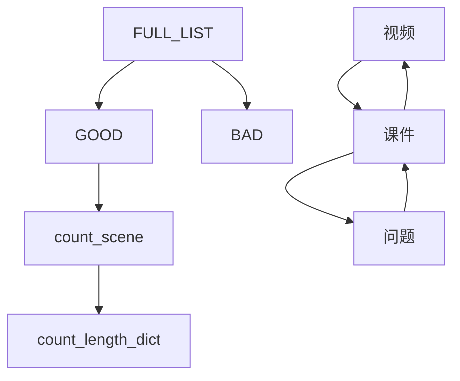

# 结论
    非辍学 点击与问题类的连续行为多
    
# video
    'seek': '11','play':12,'pause':13,
    'stop':14,'load':15
# problem
    'get':21,'check':22,'save':23,'reset_problem':24,'check_correct':25, 'check_incorrect':26
# comment
    'create_thread':31 ,'create_comment':32 ,'delete_thread':33 ,'delete_comment':34 
# click
    'click_info':41,'click_courseware':42,'click_about':43,'click_forum':44 ,'click_progress':45,'close_courseware':46

# mode
## video
    'play'<->'pause':13,12,13,12
    'play'<->'stop' :12,14,12,14

    'play'->'seek'->'pause' 
    'stop':
        

## 刷课
    'play'  'play' 'play' :12,12,12...
     
## 挑选课程
    42,46,42,15,12,13 的循环模式
    ->查看简介-关闭简介-查看简介-载入播放视频-暂停-查看简介->
## 不断点击讨论
    44，44，44，44， 
    1 查找答案
    2 查看讨论状况以确定课程情况

# 差别指标
## 10% 显著
### 424642151213     
    In  drop : 
    Sample Coverage Rate: 47 % 
    Average Occurrences : 3
    In  nondrop : 
    Sample Coverage Rate: 57 % 
    Average Occurrences : 4

## 6%
### 424642151213424642151213
    In  drop : 
    Sample Coverage Rate: 4 % 
    Average Occurrences : 1
    In  nondrop : 
    Sample Coverage Rate: 10 % 
    Average Occurrences : 1

## 5%    
### 444444
    In  drop : 
    Sample Coverage Rate: 6 % 
    Average Occurrences : 5
    In  nondrop : 
    Sample Coverage Rate: 11 % 
    Average Occurrences : 5

### 121113
    In  drop : 
    Sample Coverage Rate: 58 % 
    Average Occurrences : 3
    In  nondrop : 
    Sample Coverage Rate: 53 % 
    Average Occurrences : 3

## 3%
### 131213121312131213121312
    In  drop : 
    Sample Coverage Rate: 25 % 
    Average Occurrences : 11
    In  nondrop : 
    Sample Coverage Rate: 22 % 
    Average Occurrences : 11

# 对降采样数据分析
    2 类 11%
    4 类 12%
## 14%
###  4444444
    In  drop :
    Sample Coverage Rate: 66 %       
    Average Occurrences : 14
    In  nondrop :
    Sample Coverage Rate: 80 %       
    Average Occurrences : 22

# coverage
## 看课件 15% 1
    [42 4246 4242, 15, 0],
    [14 4246 42  , 15, 1], 
[4642   4246     , 15, 1], 
[424642 4246     , 16, 0],
[       4246 4242, 16, 1], 

    
    正确回答
    [212225, 17, 0],   
## 看视频 看课件 17% 2
          1214 42, 17, 1], 
    [42 151213 42, 16, 1],
    [42 151214   , 17, 3], 
    [42 151214 42, 18, 1],
    [   151214 42, 18, 1], 
  [4642 151214   , 15, 2],
## 看课件->看问题 18% 0
    [424621, 18, 0],  
    答对问题->看课件
    [254246, 18, 0],   
    [222542, 19, 0],
    [462142, 16, 0], 
    [462122, 16, 0],   
    [214246, 16, 0],
    [422142, 15, 0], 
    [464222, 15, 0], 
# avg
    
# get problem
    [2121212121212121212121212121, 0, 36],  
## load video /click_info
    [15431543154315431543154315, 0, 37],
    [4315431543154315431543154315, 0, 36],       
    [43154315431543154315431543, 0, 36],
## stop video
    [1414141414, 0, 33],
    [141414141414, 0, 34],
    [14141414141414, 0, 35],
    [14141414141414141414141414, 0, 39],
    [1414141414141414, 0, 39],
    [141414141414141414, 0, 40],
    [1414141414141414141414141414, 0, 41],       
    [14141414141414141414, 0, 41],
    [141414141414141414141414, 0, 42],
    [1414141414141414141414, 0, 44],
## 点击论坛  
    [444444444444444444, 0, 40],
    [44444444444444444444, 0, 57],
    [4444444444444444444444, 0, 68],
    [444444444444444444444444, 0, 71],
    [4444444444444444444444444444, 0, 99],       
    [44444444444444444444444444, 0, 101]
