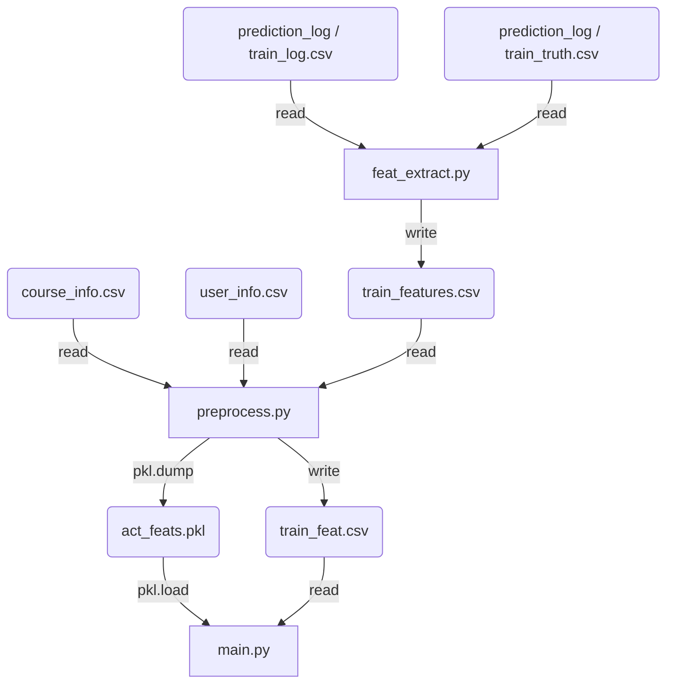
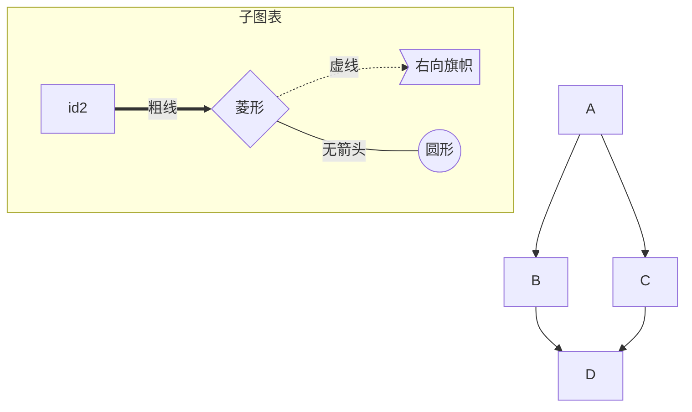

```mermaid
graph TB
    s1(prediction_log / train_log.csv)
    s2(prediction_log / train_truth.csv)
    s3(course_info.csv)
    s4(user_info.csv)

    f1(train_features.csv)
    f2(act_feats.pkl)
    f3(train_feat.csv)

    p1[feat_extract.py] 
    p2[preprocess.py]
    p3[main.py]

    s1--read   -->p1
    s2--read   -->p1
    p1--write -->f1 
    s3--read-->p2
    s4--read-->p2
    f1--read   -->p2
    p2--pkl.dump-->f2
    p2--write-->f3
    f2--pkl.load-->p3
    f3--read -->p3

    
   
```

```mermaid
graph TD;
    A-->B;
    A-->C;
    B-->D;
    C-->D;
     subgraph 子图表
        id2==粗线==>id3{菱形}
        id3-.虚线.->id4>右向旗帜]
        id3--无箭头---id5((圆形))
    end
```
