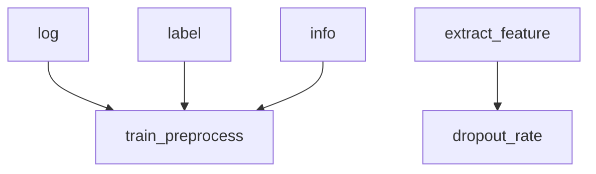
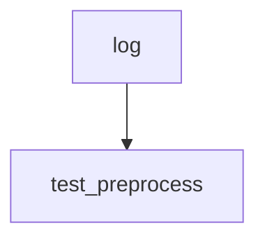

# 摘要

    对以下数据集进行分析，阐述各种分析方法的异同，并对原有解决方案做出改进。

## MOOC

    近年来，大规模的开放式在线课程（MOOC）迅速发展，并吸引了数百万的在线用户。然而，高居不下的辍学率是一个一直存在的问题。最近的报告显示，MOOC的完成率低于5％(Onah, Sinclair, and Boyatt 2014;Kizilcec, Piech, and Schneider 2013; Seaton et al. 2014)。
        导致用户辍学的主要因素是什么？
        用户学习MOOC的主要动机是什么？
    在本文中，我使用来自中国最大的MOOC之一的XuetangX的数据集，对MOOC的辍学问题进行了系统的研究。
    
    我发现用户的学习行为可以分为几种不同的模式。以及朋友的辍学行为之间的强相关性。

    基于获得的见解与假设，我使用XGBoost构建了一种可解释的预测模型来建模和预测用户的辍学行为。
    与几种现有技术相比，该方法同时具有更好的预测性能与算力开销。
    目前模型有待实际部署的检验。

## 关键词

    行为数据挖掘、可解释模型、在线教育、辍学预测
# 目录

    1. 简介
       1. 
       2. 数据集概览
    2. 数据清洗
    3. 构造特征
    4. 模型选择
    5. 模型可解释性
    6. 
## 数据集概览
    数据集由四个文件组成，描述了用户在线学习过程中产生的各种行为，以及课程与用户的信息。
    行为日志.csv ：
        记录了用户在学习过程中的点击、提问以及播放视频等行为。
        共七列，其中包含三列索引，四列特征值。
        
        索引：
            user id       :用户识别码
            course id     :课程识别码
            enrollment id :描述单一用户与单一课程之间配对关系的注册码
        特征：
            action  ： 行为类型，如点击、播放等
            session ：本次行为访问的章节编号
            object  ：行为发生的终端类型
            time：行为发生的时间
    辍学标签.csv ：
        enrollment id : 描述单一用户与单一课程之间配对关系的注册码
        dropout       : 描述用户是否辍学的布尔值，1表示辍学，0表示未辍学
            
    课程信息.csv ：
        id        ：课程识别码，用于在json数据中检索
        course id ：课程识别码，用于在csv数据中检索
        start     ：课程开课时间
        end       ：课程结课时间
        course category ：课程所属的类目，如哲学、自然科学等
        course type     ：课程类型
            课程分为监督学习与自主学习，监督学习下学生要在规定时间上交作业，自主学习下学生只需要通过期末测验   
    用户信息.csv ：
        user id ：用户识别码
        gender  ：性别
        education ：用户的受教育程度，以获得的学位来衡量
        birth     ：出生年份
        
        
### MOOC数据集:时间序列
    大规模开放式在线课程（MOOC）是一种基于网络的大规模课程，面向大量参与者。
    在过去的几年中，由于XuetangX、edX和Coursera等几个设计良好的在线教育网站的出现，
    以及诸如MIT，Stanford和UC Berkeley等顶尖大学对MOOC的支持，MOOC受到了越来越多的欢迎,并向广大公众开放各种课程。
   无论个人背景如何，都可以从mooc获得高质量的教育。
    MOOC课程通常包含简短的讲座视频（10-15分钟）以及测验和家庭作业，以评估学生对课程的理解。
    尽管mooc十分受欢迎，但开放的性质意味着学生的留存率是一个重大问题， 
    因为几乎任何人都可以注册该课程，并且因课程失败而带来的后果几乎可以忽略。
    这样一来，大量的学生报名参加课程，但没有参加后续学习过程，
    并且学生在课程的每个阶段都会发生辍学（图1中说明了不同大学在不同网站上提供的两种不同的MOOC） ）。
    从不参与课程的学生的问题可能是由于课程本身之外的因素引起的，而后一种现象表明，无论出于何种原因，学生都失去了完成课程的意愿。
    在体育学院和大学中也观察到这种行为，尽管规模较小[1]，但已尝试使用事件历史模型[2]来了解这种行为。
    事实证明，这样的模型对于推断学生离校的原因以及建议机构减轻问题的干预措施非常有用
#### what
    假设：
        每一类学生都有其固定的行为模式
        可以根据行为模式区分不同种类的学生/课程
            

#### why 
    模式：
        访问频次：频繁访问的不容易辍学
        访问的概率分布密度：
            均匀的不容易辍学
            合众的不容易辍学
            每种行为都有的不容易辍学
            注册课程数量合适

#### how
    遍历每个用户的日志
    总结出每个用户的统计指标
    根据哈希表查找各个课程下的用户情况再二次统计
    进而判断用户情况
### 物联网数据集
    时间序列
### 音乐流派数据集
    评分数据
### 通讯基站流量数据集
    时间序列

## 数据集探索性分析

## 数据清洗

### 空值/错误值
### 格式转换
    时间映射
    向量化

## 数据挖掘/特征构造
   **一个事件发生的几率（Odds），是指该事件发生的概率与该事件不发生概率的比值。**
### 聚合
    groupby
### 统计值
    mean/var/std/ku/su
### 聚类

### 特征增益
    entropy/genni index

## 模型选择

### 手动选择
#### 传统机器学习算法
##### 决策树
##### 逻辑回归
##### 评分卡模型
##### SVM

#### 深度学习算法
##### 多层感知机
##### RNN
##### CNN

### 自动选择
#### 遗传算法
#### 模拟退火算法

## 模型解释性
### 传统机器学习
### 深度学习

