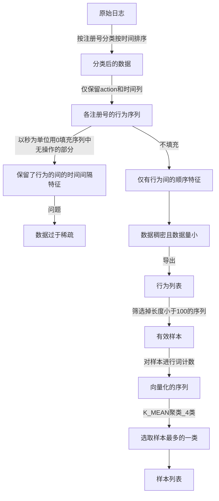
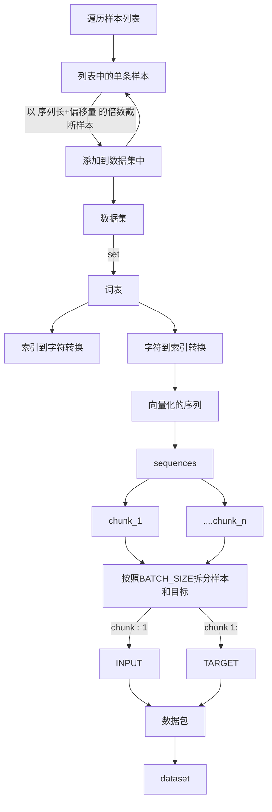
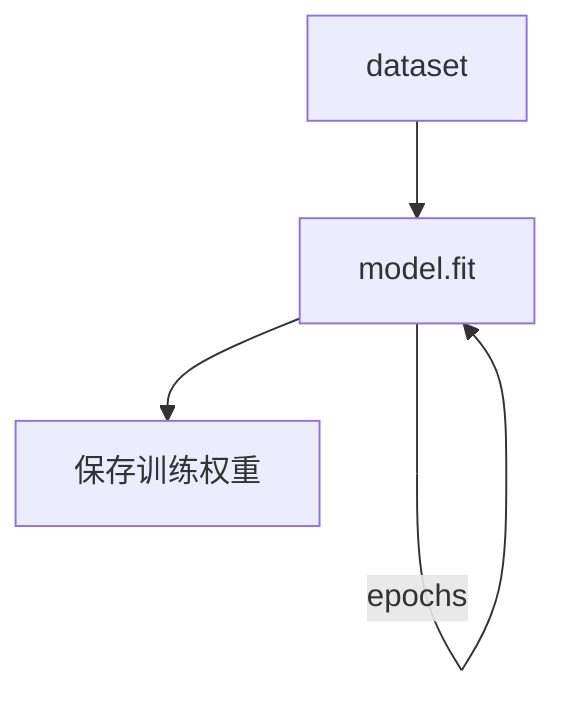
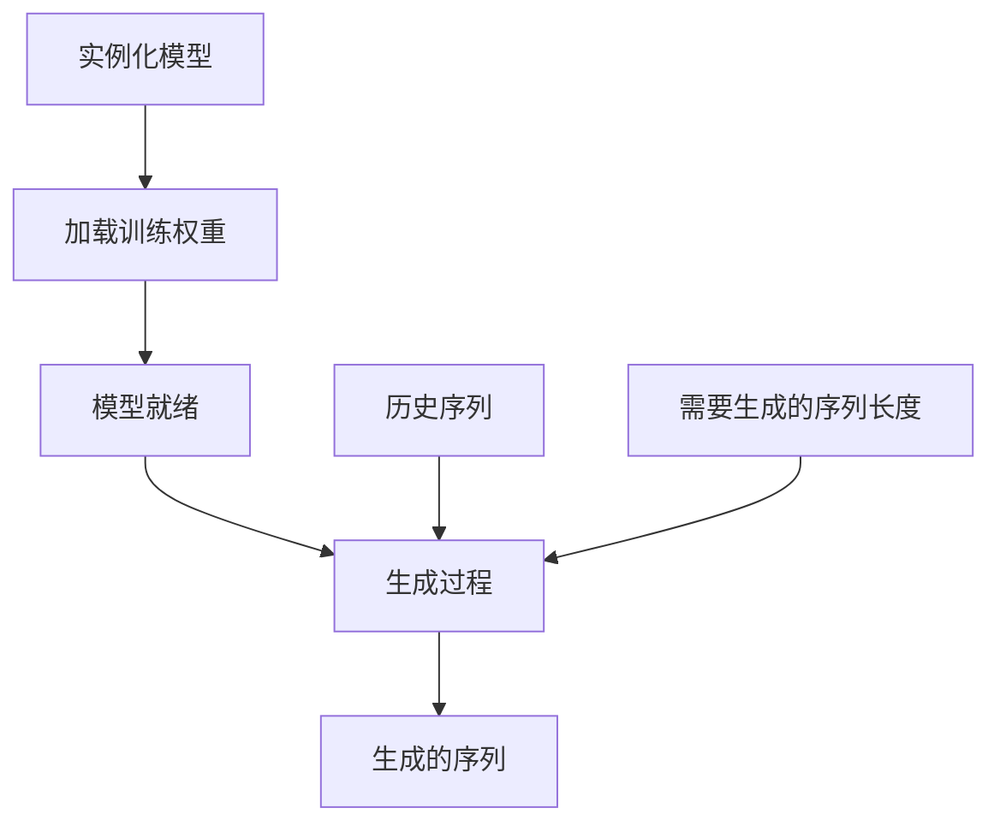
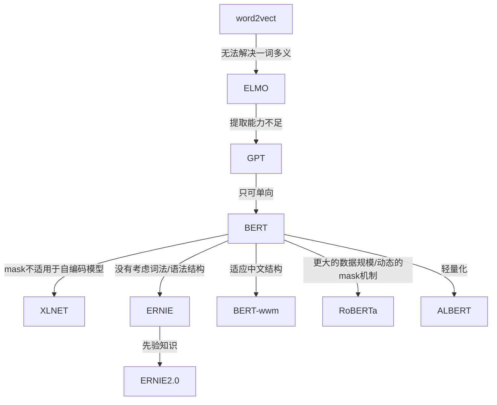

## 概要
    (1) 对mooc数据的预测
        提取mooc数据集中的用户行为序列
        采用生成对抗网络通过历史行为序列预测未来行为序列

    (2) 对自然语言处理的了解   
        了解整理了近年比较热门的一些NLP模型
    
    (3) 后续安排

## 一 、对mooc数据的预测
参数解释：
    epoch：一次完整的训练  
    SEQUENCE_LENGTH  序列长：
        在一个epoch的训练中，数据不是一次性输入让模型拟合，而是小批次进入输入，多次拟合。SEQUENCE_LENGTH就是小批次输入的序列长度
    BATCH_SIZE = 1   偏移量：训练序列与预测序列的偏移量 即预测一个时间步长
### 数据准备

问题：聚类方式的选择没有经过推导，以及聚类的类数仅凭直观

    
### 训练 
    目前采用的模型还没经过分析推导，只是采用了Google的文本生成模板，核心节点选择的是GRU，是RNN的一种改进。目前我只对比了一下数据量，将模型参数降低了几个数量级。

    link：https://www.tensorflow.org/tutorials/text/text_generation

### 生成 

### 待解决的问题
    1 生成模型的评价指标
        
        目前的评价方式如下：
            序列长度 == n
            输入模型的序列长度 p
            生成序列长度 n-p

            统计生成的序列中各元素的数量，与原始序列相同位置的统计情况进行对比。
        发现 单从计次值来看 各元素的偏差都在上下20次以内，感觉比较乐观，但好不严谨，完全没考虑到顺序。

        我想构建一个比较直观的评价指标，像简单任务中我们会用正确率、准确率等。
        在训练阶段是通过判断预测的那一个步长是否正确，
        但在生成阶段，我觉得用余弦相似度之类的距离度量方式来量化比较合适。
        正在看的材料：https://www.cnblogs.com/AlvinSui/p/8931074.html

       
    2 模型的推导
        前文也说了，这个模型是Google的模板，我只是改小了参数，还需要严格的推导。

## 二、对自然语言处理的新了解 
    可以按照模型的建立方式以及提取数据特征的方式对NLP模型进行分类

### 自回归语言模型(AR)：
    简述： 根据t-1时刻推断t时刻
    from Wikipedia：
    优点 :所需资料不多，可用自身变数数列来进行预测
    限制 :必须具有自相关，自相关系数是关键。
            如果自相关系数(R)小于0.5，则不宜采用，否则预测结果极不准确。 
            自回归只能适用于预测受自身历史因素影响较大的经济现象，如矿的开采量，各种自然资源产量
            所以，对于受社会因素影响较大的经济现象，不宜采用自回归，而应改采可纳入其他变数的向量自回归模型。
    限制：AR的单向特性 
            只能利用上文或者下文的信息，不能同时利用上文和下文的信息，
            貌似ELMO这种双向都做，然后拼接看上去能够解决这个问题，
            但因为融合模式过于简单，所以效果其实并不是太好。
    优点：AR的单向特性天然的匹配了实际应用中的情况 
            比如生成类NLP任务/文本摘要/机器翻译等，
            在实际生成内容的时候，就是从左向右的，
            自回归语言模型天然匹配这个过程。
### 自编码语言模型(AE):
    简述：根据t-1与t+1时刻预测t时刻

    reference： https://zhuanlan.zhihu.com/p/70257427
    自编码语言模型的优缺点与自回归语言模型相反 
    自回归语言模型只能根据上文预测下一个单词，或者反过来，只能根据下文预测前面一个单词。
    相比而言，Bert通过在输入X中随机Mask掉一部分单词，
    然后预训练过程的主要任务之一是根据上下文单词来预测这些被Mask掉的单词，
    这是典型的DAE的思路 Denoising Autoencoder
    那些被Mask掉的单词就是在输入侧加入的所谓噪音。类似Bert这种预训练模式，被称为DAE

    优点 ：DAE能比较自然地融入双向语言模型，同时看到被预测单词的上文和下文
    
    限制（我还没理解） ：在输入侧引入[Mask]，导致预训练阶段和微调阶段不一致的问题，
            因为微调阶段是看不到[Mask]标记的。
         

### 单向特征、自回归模型（单向模型）：
    ELMO/
    ULMFiT/
    SiATL/
    GPT1.0/
    GPT2.0
### 双向特征、自编码模型（BERT系列模型）：
    BERT/
    ERNIE/
    SpanBERT/
    RoBERTa
### 双向特征、自回归模型:
    XLNet

### 『各模型之间的联系 』
    reference： https://zhuanlan.zhihu.com/p/70257427
    

    传统word2vec无法解决一词多义，语义信息不够丰富，诞生了ELMO
    ELMO以lstm堆积，串行且提取特征能力不够，诞生了GPT
    GPT 虽然用transformer堆积，但是是单向的，诞生了BERT
    BERT虽然双向，但是mask不适用于自编码模型，诞生了XLNET
    BERT中mask代替单个字符而非实体或短语，没有考虑词法结构/语法结构，诞生了ERNIE
    为了mask掉中文的词而非字，让BERT更好的应用在中文任务，诞生了BERT-wwm
    Bert训练用更多的数据、训练步数、更大的批次，mask机制变为动态的，诞生了RoBERTa
    ERNIE的基础上，用大量数据和先验知识，进行多任务的持续学习，诞生了ERNIE2.0
    BERT-wwm增加了训练数据集、训练步数，诞生了BERT-wwm-ext
    BERT的其他改进模型基本考增加参数和训练数据，考虑轻量化之后，诞生了ALBERT

    note:mask
        处理非定长序列
        在NLP中，文本一般是不定长的，所以在进行 batch训练之前，要先进行长度的统一，过长的句子可以截断到固定的长度，过短的句子可以通过 padding 增加到固定的长度，但是 padding 对应的字符只是为了统一长度，并没有实际的价值，因此希望在之后的计算中屏蔽它们，这时候就需要 Mask。

# 后续安排
    1 把前面列出的问题解决
    2 2.1号数学建模美赛4天
    3 毕业后的安排
        考研，大四的时间太珍贵了我没去考。
        
        为什么要读研：
            这段时间对工作和学习有了新的了解
            学习：
                对于自然语言处理，以一种新的方式来描述并构建语言和知识，我还挺喜欢的。
                也意识到这个方向的知识浩如烟海，了解就要费不少时间。想有点成绩、弄个大新闻需要时间，可能一两年也不够，后面读博也有可能。
            工作:
                如果这时候去工作，能力与野心尚不匹配，可能做不了自己喜欢的内容，工作首先是为了赚钱，为了赚钱就要做很多妥协。
            
            和家人商量了一下，经济上家里不需要我帮忙，也支持我继续学习。
            听取了在业界做顾问的朋友的建议，疫情导致就业形势不明朗，在这个年龄，深造是个不错的选择。

