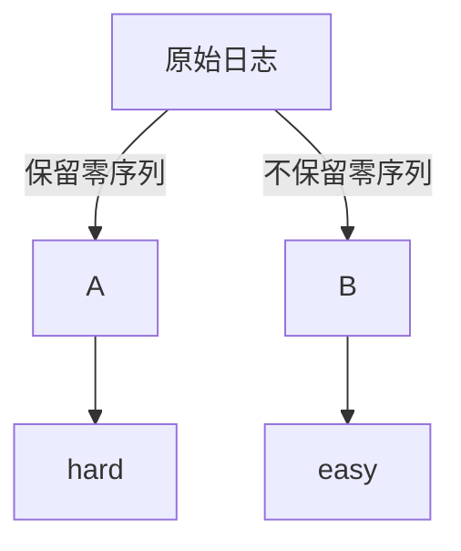
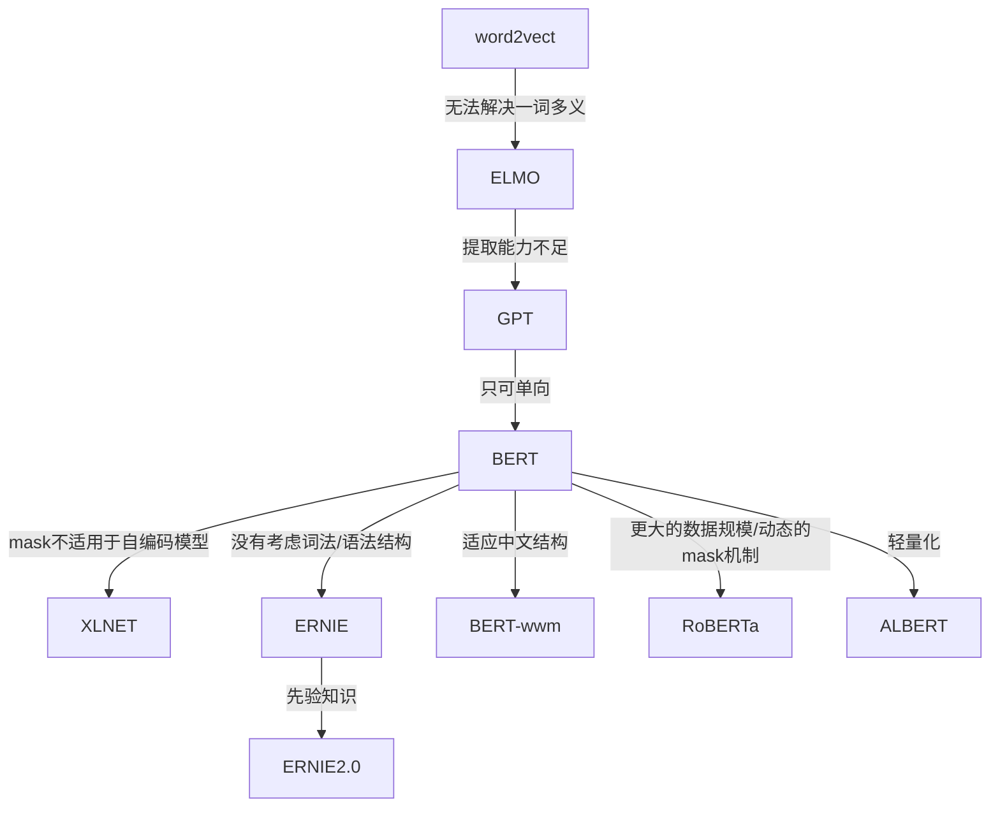

## 概要
    1 预处理进度
        标签制作
        过滤工具
    2 唐杰团队
        aminder

    3 衡量距离的方式
    4 模型没跑起来  
    

##   文本预处理
    (1) tokenization 分词 v
    (2) stop words   去除停止词 v

    (3) counting     词计数
        a. wordbag     v
        b. n-gram      v
    (4) tf-idf width 
##   分析方法
    1 聚类
        Kmean
        怎么展示
       
## 任務分割

## Tune Hyperparameters

We had to choose a number of hyperparameters for defining and training the model. We relied on intuition, examples and best practice recommendations. Our first choice of hyperparameter values, however, may not yield the best results. It only gives us a good starting point for training. Every problem is different and tuning these hyperparameters will help refine our model to better represent the particularities of the problem at hand. Let’s take a look at some of the hyperparameters we used and what it means to tune them:

#### Number of layers in the model
: The number of layers in a neural network is an indicator of its complexity. We must be careful in choosing this value. Too many layers will allow the model to learn too much information about the training data, causing overfitting. Too few layers can limit the model’s learning ability, causing underfitting. For text classification datasets, we experimented with one, two, and three-layer MLPs. Models with two layers performed well, and in some cases better than three-layer models. Similarly, we tried sepCNNs with four and six layers, and the four-layer models performed well.

#### Number of units per layer
: The units in a layer must hold the information for the transformation that a layer performs. For the first layer, this is driven by the number of features. In subsequent layers, the number of units depends on the choice of expanding or contracting the representation from the previous layer. Try to minimize the information loss between layers. We tried unit values in the range [8, 16, 32, 64], and 32/64 units worked well.

#### Dropout rate
: Dropout layers are used in the model for regularization. They define the fraction of input to drop as a precaution for overfitting. Recommended range: 0.2–0.5.

#### Learning rate
: This is the rate at which the neural network weights change between iterations. A large learning rate may cause large swings in the weights, and we may never find their optimal values. A low learning rate is good, but the model will take more iterations to converge. It is a good idea to start low, say at 1e-4. If the training is very slow, increase this value. If your model is not learning, try decreasing learning rate.

There are couple of additional hyperparameters we tuned that are specific to our sepCNN model:

#### Kernel size
: The size of the convolution window. Recommended values: 3 or 5.

#### Embedding dimensions
: The number of dimensions we want to use to represent word embeddings—i.e., the size of each word vector. Recommended values: 50–300. In our experiments, we used GloVe embeddings with 200 dimensions with a pre- trained embedding layer.

Play around with these hyperparameters and see what works best. Once you have chosen the best-performing hyperparameters for your use case, your model is ready to be deployed.

## 语言模型分类 

#### 单向特征、自回归模型（单向模型）：
    ELMO/
    ULMFiT/
    SiATL/
    GPT1.0/
    GPT2.0
#### 双向特征、自编码模型（BERT系列模型）：
    BERT/
    ERNIE/
    SpanBERT/
    RoBERTa
#### 双向特征、自回归模型:
    XLNet

## 『各模型之间的联系 』

    传统word2vec无法解决一词多义，语义信息不够丰富，诞生了ELMO
    ELMO以lstm堆积，串行且提取特征能力不够，诞生了GPT
    GPT 虽然用transformer堆积，但是是单向的，诞生了BERT
    BERT虽然双向，但是mask不适用于自编码模型，诞生了XLNET
    BERT中mask代替单个字符而非实体或短语，没有考虑词法结构/语法结构，诞生了ERNIE
    为了mask掉中文的词而非字，让BERT更好的应用在中文任务，诞生了BERT-wwm
    Bert训练用更多的数据、训练步数、更大的批次，mask机制变为动态的，诞生了RoBERTa
    ERNIE的基础上，用大量数据和先验知识，进行多任务的持续学习，诞生了ERNIE2.0
    BERT-wwm增加了训练数据集、训练步数，诞生了BERT-wwm-ext
    BERT的其他改进模型基本考增加参数和训练数据，考虑轻量化之后，诞生了ALBERT

#### mask
    处理非定长序列
    在NLP中，文本一般是不定长的，所以在进行 batch训练之前，要先进行长度的统一，过长的句子可以截断到固定的长度，过短的句子可以通过 padding 增加到固定的长度，但是 padding 对应的字符只是为了统一长度，并没有实际的价值，因此希望在之后的计算中屏蔽它们，这时候就需要 Mask。

note: 
    DAE 模式: Denoising Autoencoder 

    D Denoising
    AE autoencoder
    AR autoregression
