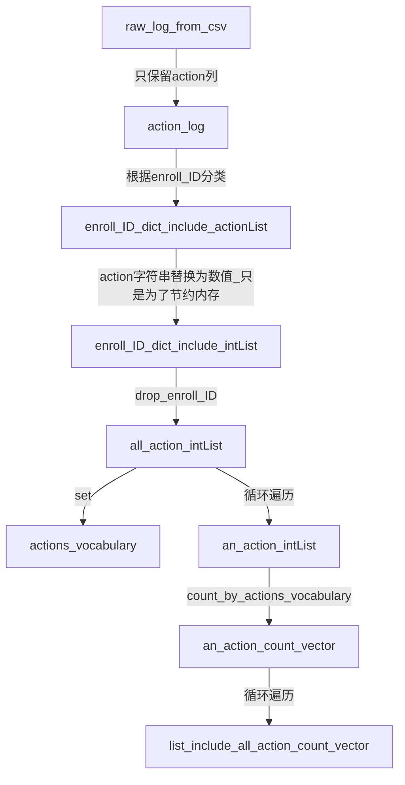

## 问题简述
    问题1 词计数、行为序列
        从原始数据到预处理的完成的数据流程，pdf中我整理了一份流程图，在data_describe.py 展示了一部分样例数据，两份文件参照着看比较好理解。
    问题2 
        预测目标：
        原先的预测目标是单纯的判断用户是否辍学，深入了解后发现，辍学的定义并不清晰。
        KDDCUP2015数据集以及MOOCdata.cn数据集的来源都是XuetangX平台，先前对辍学的定义是KDDCUP2015给出,定义如下：
            某时间点后的十天内用户无操作 
        辍学的定义并不是来自，用户在平台上点击确认放弃一门课程，也不是用户没有通过期末审核。(平台没有公开 用户是否通过课程 的数据)

        所以，我觉得基于moocdata.cn数据集的探索，都是对用户未来行为的预测，辍学只是把用户消极学习这种行为特征标签化了。最终要预测的其实是用户的行为，我们通过行为评价用户辍学与否。

        为什么用文本生成网络：
        在上一份周报中，我把用户的行为序列类比为一段文本。
        人类语言中，会含有主谓宾这种常见模式，而用户行为序列中也存在，如：点击视频->提出问题,提出问题->点击视频,点击作业->播放视频，这些由于序列中元素的不同排列组合而显现出来的模式，我觉得可以很好的区分不同类别的用户。
        所以我把行为序列当作一句话来看待。

        模型运行结果：一段由我给定长度的行为序列
        可参照 data_describe.py

